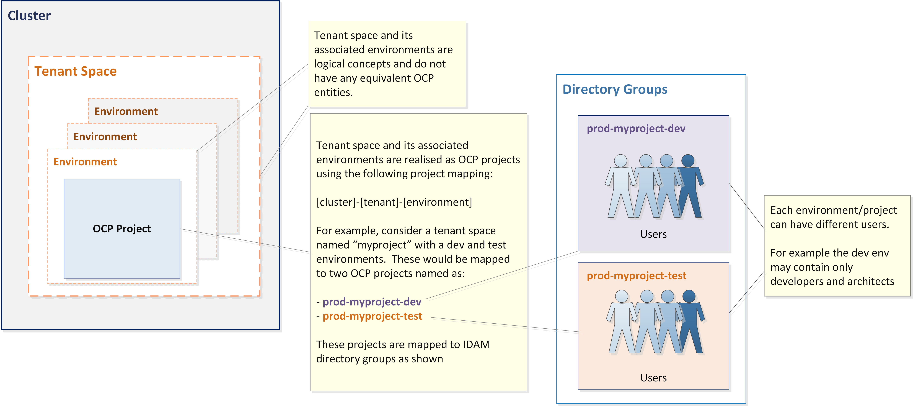

# ocp_manage_tenant

* [Description](#description)
* [Appendix](#appendix)

## Features

* [Create Tenant](/doc/create-tenant.md)
* [Decommission Tenant](/doc/decommission-tenant.md)
* [Add Project/Environment to Tenant Space](/doc/add-project.md)
* [Remove Project/Environment from Tenant Space](/doc/remove-project.md)
* [Amend Project](/doc/create-tenant.md)
* [Add Users to Project](/doc/add-user.md)
* [Remove Users from Project](/doc/Remove.md)

## Description

A role library to manage OpenShift tenants.

A **tenant** is a logical concept and correspond to a collection of OCP projects (or Kubernetes Namespaces). A tenant provides the structure on which to build a Continuous Delivery (CD) pipeline. For example, a tenant can be made up of the following OCP projects(environments):

* **DEV**

  * where the automation server is deployed to control the deployment of artefacts across the CD pipeline.
  * where the application source code is integrated, one or more Docker images are produced using Source to Image (S2I) technology in OCP.
  * where automated tests are executed.

* **TEST**

  * where manual functional testing activities are carried out.

* **DEMO**

  * where product owners can explore the features of the application before it progresses any further in the CD pipeline.

The diagram below shows the relationship between tenant spaces, environments and OCP projects. A tenant space can have many environments and each environment can have many OCP projects. For example, a web application can consist of a WEB, application and data layers. In this case, each environment may be made up with three OCP projects each representing a particular layer. In addition, it will be necessary to configure NS and EW security within the tenant space (i.e. micro-segmentation and machine trust access). Therefore, the structure of a tenant space will vary dependant on the type of application that it will serve. Release 1 will only provide one application template which will have only one OCP project per environment without micro-segmentation and machine trust access.



An environment will correspond to a project with the flatten project name of [tenant_name]-[environment_name] (e.g sometenant-test where sometenant is the name of the tenancy and test is the name of the environment).

### OCP Project to IDAM Group Mapping

IDAM will utilizes a flatten group structure. This means that OCP projects will mapped directly to an IDAM group as shown in the diagram.

[↥ Back To Top](#ocp_manage_tenant)

## Common Configurations

A list of the common external variables used by the role libraries

| Variable        | Description                                                                                                     | Example                             |
| --------------- | --------------------------------------------------------------------------------------------------------------- | ----------------------------------- |
| **ocp_uri**     | The URI of the OCP master server associated with the desired cluster, including port.                           | https://127.0.0.1:8443              |
| **ocp_token**   | The token used to authenticate with the OCP server. It should be for a service account with cluster-admin role. | "account-token-89si3"               |
| **tenant_name** | The name of the tenant to be created. This name is used to name the projects in a CD the pipeline.              | MyApp                               |
| **projects**    | A list of projects (environments) making up the Tenant.                                                         | See usage section \* create tenant. |

---

## Appendix

### How to create a token

```bash
# log in as sys admin
$ oc login -u system:admin

# creates a service account
$ oc create sa automator -n openshift-infra

# adds the account to the admin role
$ oc adm policy add-cluster-role-to-user cluster-admin system:serviceaccount:openshift-infra:automator

# gets the value of the token using the name
$ oc serviceaccounts get-token automator -n openshift-infra
```

### How to check access rights

```bash
$ oc get sa automator -o yaml
$ oc policy who-can create ProjectRequest
```

[OCP API](https://docs.openshift.com/container-platform/3.6/rest_api/openshift_v1.html)
